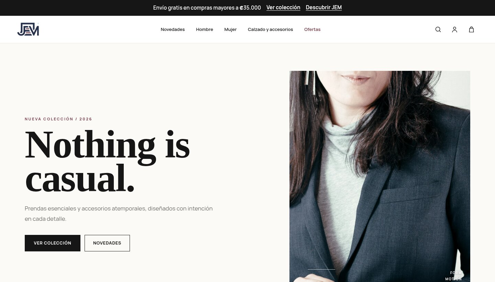

<p align="center">
  
</p>

<p align="center">
  <a href="https://github.com/Eme2004/JEM-Store/actions/workflows/deploy.yml">
    
  </a>
  
  
  
  
</p>

<p align="center">
  
</p>

# JEM Store

Tienda de moda contemporánea construida con Laravel — catálogo, carrito, checkout con
pasarela de pago real en modo **sandbox** (Braintree), panel de administración, historial
de pedidos y reportes de ventas en PDF.

Proyecto académico / de portafolio. Ver [`docs/PRODUCT_IMAGES.md`](docs/PRODUCT_IMAGES.md)
y la página [Disclaimer](https://jemstore.alwaysdata.net/legal/disclaimer) para el detalle
de qué es real y qué es simulado.

**Producción:** https://jemstore.alwaysdata.net



## Características

- **Catálogo** con búsqueda, filtros por categoría, público (hombre/mujer/unisex), rango
  de precio y ofertas.
- **Carrito y checkout** con cálculo de impuestos y envío, y pago con tarjeta real vía
  **Braintree Sandbox** (Hosted Fields — el número de tarjeta y el CVV nunca tocan el
  servidor de JEM Store, solo un token generado por Braintree en el navegador).
- **Cuentas de usuario**: registro, login, perfil, historial de pedidos con detalle de la
  transacción de pago.
- **Panel de administración** (`/admin/productos`): crear, editar y eliminar productos,
  con subida de foto, preview instantáneo y reemplazo/eliminación seguros.
- **Reportes de ventas** filtrables por mes y cliente, con descarga en **PDF** con diseño
  propio (logo, indicadores, tabla y resumen).
- **Páginas legales** propias (Disclaimer, Terms of Use, Privacy Policy).
- Diseño responsive de extremo a extremo (mobile / tablet / desktop).
- **Despliegue automático**: cada push a `main` corre los tests, compila los assets y
  despliega a producción vía SSH — sin FTP, sin pasos manuales.

## Stack

| | |
|---|---|
| Backend | Laravel 12 (PHP ^8.2) |
| Base de datos | SQLite |
| Frontend | Blade, Bootstrap 5, Sass, Vite |
| Pagos | Braintree Sandbox (`braintree/braintree_php`) |
| PDF | `barryvdh/laravel-dompdf` |
| Hosting | [alwaysdata](https://www.alwaysdata.com/) |
| CI/CD | GitHub Actions (tests → build → rsync/SSH) |

## Empezar en local

```bash
git clone https://github.com/Eme2004/JEM-Store.git
cd JEM-Store

composer install
npm install

cp .env.example .env
php artisan key:generate

touch database/database.sqlite
php artisan migrate --seed

php artisan storage:link

npm run build   # o `npm run dev` para desarrollo
php artisan serve
```

La app queda disponible en `http://localhost:8000`.

### Imágenes de producto

Las fotos del catálogo viven en `storage/app/public/products/{slug}.webp` (curadas y
documentadas en [`docs/PRODUCT_IMAGES.md`](docs/PRODUCT_IMAGES.md)) y ya vienen en el
repo. Para sincronizarlas contra los productos existentes sin tocar precio, stock ni
ningún otro dato:

```bash
php artisan products:sync-images
```

Las fotos subidas manualmente desde el panel de administración se guardan aparte, en
`storage/app/public/products/uploads/`, y ese comando nunca las toca ni las revierte.

### Pagos (Braintree Sandbox)

Sin credenciales configuradas, el checkout usa automáticamente una pasarela simulada
equivalente — la app y los tests funcionan igual, solo que sin pegarle a la API real de
Braintree. Para probar el sandbox real, agregá a tu `.env`:

```
BRAINTREE_ENV=sandbox
BRAINTREE_MERCHANT_ID=
BRAINTREE_PUBLIC_KEY=
BRAINTREE_PRIVATE_KEY=
```

(Se generan gratis creando una cuenta en [Braintree Sandbox](https://www.braintreepayments.com/).
Nunca se procesan cobros reales en este modo — es el ambiente de pruebas oficial.)

Tarjeta de prueba: `4111 1111 1111 1111`, cualquier fecha futura, cualquier CVV de 3
dígitos.

## Tests

```bash
php artisan test
```

118 tests / 305 assertions cubriendo catálogo, carrito, checkout (pago aprobado,
rechazado, doble envío), cuentas, pedidos, panel admin, reportes y páginas legales.

## Despliegue

Cada push a `main` dispara `.github/workflows/deploy.yml`:

```
push a main
  → tests (php artisan test)
  → build (npm run build)
  → composer install --no-dev
  → rsync/SSH a alwaysdata
  → migrate --force · storage:link · products:sync-images · optimize
```

`.env` y `database/database.sqlite` de producción nunca se tocan ni se sobrescriben — el
deploy no usa `rsync --delete` y excluye ambos archivos explícitamente.

## Créditos

Website & Branding — Emesis Mairena y Jairo Herrera.

Fotografía de producto y del home: Unsplash / Pexels, uso libre. Fuentes documentadas en
[`docs/PRODUCT_IMAGES.md`](docs/PRODUCT_IMAGES.md) y [`docs/HOME_IMAGES.md`](docs/HOME_IMAGES.md).

<p align="center">
  
</p>
