<!-- Portada -->

{width=2.2in}

::: {custom-style="Title"}
JEM STORE
:::

**Sistema Web de Comercio Electrónico**

**Documentación del Proyecto**

&nbsp;

**Integrantes:**

Emesis Mairena

Jairo Herrera

&nbsp;

**2026**

&nbsp;

Universidad: _______________________________________________

Curso: _____________________________________________________

Profesor: __________________________________________________

Fecha de entrega: __________________________________________

&nbsp;

Repositorio: [https://github.com/Eme2004/JEM-Store](https://github.com/Eme2004/JEM-Store)

Producción: [https://jemstore.alwaysdata.net](https://jemstore.alwaysdata.net)

```{=openxml}
<w:p><w:r><w:br w:type="page"/></w:r></w:p>
```

# Tabla de contenido

```{=openxml}
<w:p>
  <w:r><w:fldChar w:fldCharType="begin" w:dirty="true"/></w:r>
  <w:r><w:instrText xml:space="preserve"> TOC \o "1-3" \h \z \u </w:instrText></w:r>
  <w:r><w:fldChar w:fldCharType="separate"/></w:r>
  <w:r><w:t>Haga clic derecho sobre esta área y seleccione "Actualizar campos" (o presione F9) para generar la tabla de contenido.</w:t></w:r>
  <w:r><w:fldChar w:fldCharType="end"/></w:r>
</w:p>
```

```{=openxml}
<w:p><w:r><w:br w:type="page"/></w:r></w:p>
```

# Introducción

JEM Store es una aplicación web de comercio electrónico orientada a la venta de ropa,
calzado y accesorios contemporáneos. El proyecto se desarrolló como trabajo académico y
de portafolio, con el objetivo de aplicar en un producto completo y funcional los
conceptos de desarrollo web full-stack: autenticación de usuarios, gestión de un
catálogo de productos, carrito de compras, un proceso de checkout con pasarela de pago
real en modo de pruebas, generación de reportes en PDF y despliegue automático a un
servidor de producción.

El desarrollo respondió a la necesidad de construir, dentro de un contexto de curso, un
sistema que no se quedara en un prototipo aislado sino que reprodujera con fidelidad el
flujo completo de una tienda en línea real: desde que un visitante navega el catálogo
hasta que recibe la confirmación de su pedido con número de seguimiento. Para lograrlo se
usó Laravel como framework backend, una base de datos SQLite y una pasarela de pago real
(Braintree) configurada exclusivamente en modo *sandbox*, de manera que el comportamiento
técnico —tokenización de tarjeta, aprobación o rechazo de transacciones, manejo de
errores— sea el mismo que tendría un pago real, sin procesar jamás dinero verdadero.

JEM Store simula, entonces, una tienda de ropa en línea completa. El catálogo permite
explorar productos por categoría, público (hombre, mujer, unisex) y precio; el carrito
calcula automáticamente impuestos y costo de envío; el checkout admite pago con tarjeta
(vía Braintree Sandbox) o PayPal (flujo simulado); y cada compra concluye con un pedido
registrado, un número de seguimiento y un historial consultable por el cliente. El sitio
cuenta además con un panel de administración para gestionar el catálogo y con reportes de
ventas descargables en PDF.

Entre sus capacidades principales están: registro e inicio de sesión de usuarios, un
catálogo con búsqueda y filtros, un carrito persistente por sesión, un checkout con
validaciones de stock en tiempo real y protección contra doble envío del formulario, un
panel de administración protegido por rol, reportes de ventas filtrables, páginas legales
propias y un pipeline de integración continua que corre las pruebas automatizadas antes
de cada despliegue a producción.

Esta documentación describe únicamente funcionalidades verificadas directamente en el
código fuente del proyecto (rutas, controladores, servicios, modelos y pruebas), evitando
describir capacidades que no estén realmente implementadas.

# Descripción del proyecto

JEM Store es, en términos funcionales, una tienda en línea de moda contemporánea. El
catálogo agrupa los productos en tres grandes familias —ropa, calzado y accesorios— cada
una dividida en subcategorías (camisetas, camisas, blusas, chaquetas, jeans, faldas,
pantalones, polos, shorts, sudaderas, suéteres, vestidos, botas, sandalias, tenis,
zapatos, bolsos, carteras, cinturones, gafas, gorras y sombreros, joyería), y cada
producto se etiqueta además por público objetivo (hombre, mujer o unisex).

La aplicación se organiza en los siguientes módulos, todos verificables en el código
fuente del repositorio:

- **Catálogo** (`ProductController`): listado paginado de productos con búsqueda por
  nombre/descripción, filtro por público, categoría, grupo, rango de precio y ofertas;
  vista de detalle con "productos vistos recientemente" mediante una cookie.
- **Usuarios** (`Auth\*Controller`, `ProfileController`): registro, inicio y cierre de
  sesión, recuperación de contraseña, perfil editable.
- **Carrito** (`CartController`, `CartService`): agregar, actualizar cantidad, eliminar y
  vaciar productos; cálculo de subtotal, impuesto y envío.
- **Checkout** (`CheckoutController`, `CheckoutService`): captura de datos de envío,
  selección de método de pago, cobro a través de la pasarela y creación del pedido dentro
  de una transacción de base de datos.
- **Pagos** (`App\Services\Payments\*`): abstracción de pasarela de pago con una
  implementación real (Braintree Sandbox) y una simulada equivalente para desarrollo y
  pruebas.
- **Pedidos** (`OrderController`): historial de compras del cliente y detalle de cada
  pedido, incluyendo número de seguimiento.
- **Administración** (`Admin\ProductController`): gestión completa del catálogo
  (crear, editar, eliminar productos, subir imágenes) restringida a usuarios con rol de
  administrador.
- **Reportes** (`ReportController`, `ReportService`): reportes de ventas filtrables por
  mes y por cliente, exportables en PDF.

El proyecto está publicado en el repositorio
[github.com/Eme2004/JEM-Store](https://github.com/Eme2004/JEM-Store) y desplegado en
producción en [jemstore.alwaysdata.net](https://jemstore.alwaysdata.net), donde cada
push a la rama `main` dispara pruebas automatizadas, compilación de assets y despliegue
por SSH sin intervención manual.

# Objetivo general

Desarrollar una aplicación web de comercio electrónico funcional para la venta de ropa,
calzado y accesorios, que implemente de extremo a extremo el flujo de una tienda en
línea real —catálogo, carrito, checkout con pago verificable, gestión de pedidos y
administración del catálogo— aplicando prácticas actuales de desarrollo backend,
seguridad y despliegue continuo.

# Objetivos específicos

- Implementar autenticación y gestión de cuentas de usuario (registro, login, perfil).
- Facilitar la exploración del catálogo mediante búsqueda y filtros (categoría, público,
  precio, ofertas).
- Gestionar un carrito de compras persistente por sesión con cálculo automático de
  impuestos y envío.
- Implementar un proceso de checkout completo, con validación de stock y protección
  contra el reenvío accidental del formulario de compra.
- Integrar una pasarela de pago real en modo sandbox (Braintree), sin exponer datos de
  tarjeta al servidor de la aplicación.
- Registrar cada pedido con número de orden y de seguimiento, y permitir su consulta
  posterior.
- Proveer un panel de administración para gestionar productos, incluyendo carga de
  imágenes.
- Generar reportes de ventas filtrables y exportables en PDF.
- Aplicar prácticas de seguridad básicas (protección CSRF, validación de entradas,
  control de acceso por rol, transacciones de base de datos) y publicar el sitio bajo
  HTTPS mediante un pipeline de integración y despliegue continuos.

# Alcance del proyecto

JEM Store cubre el flujo completo de una tienda en línea desde la perspectiva de dos
roles: **cliente** y **administrador**. Incluye catálogo público, cuentas de usuario,
carrito, checkout con pago real en sandbox, historial de pedidos, panel de
administración de productos y reportes de ventas en PDF.

Quedan fuera del alcance —y así se documenta explícitamente en la página de Disclaimer
del propio sitio— el procesamiento de pagos reales (todo pago se ejecuta en modo
sandbox), la gestión de inventario multi-almacén, la logística de envío real (el número
de seguimiento se genera internamente y no corresponde a una transportadora), y la
integración con pasarelas adicionales más allá de Braintree y una confirmación simulada
de PayPal.

# Tecnologías utilizadas

| Tecnología | Versión | Uso en JEM Store |
|---|---|---|
| PHP | ^8.2 (probado con 8.2.12) | Lenguaje del backend |
| Laravel | 12.65.0 | Framework backend (rutas, ORM, autenticación, validación) |
| SQLite | motor embebido de PHP (`pdo_sqlite`) | Base de datos de la aplicación |
| Blade | incluido en Laravel 12 | Motor de plantillas de las vistas |
| Bootstrap | 5.3.8 | Framework CSS para el frontend |
| Sass | 1.102.0 | Preprocesador de estilos (`resources/sass`) |
| Vite | 7.3.6 | Empaquetado de assets (JS/CSS) |
| laravel-vite-plugin | 2.1.0 | Integración de Vite con Laravel |
| @popperjs/core | 2.11.8 | Dependencia de los componentes interactivos de Bootstrap |
| JavaScript | vanilla (ES modules) | Interactividad del frontend (`resources/js/app.js`) |
| barryvdh/laravel-dompdf | v3.1.2 | Generación de los reportes de ventas en PDF |
| braintree/braintree_php | 6.37.0 | SDK oficial de la pasarela de pago Braintree |
| Composer | 2.x | Gestor de dependencias PHP |
| npm | 11.13.0 (local) | Gestor de dependencias JavaScript |
| Git / GitHub | — | Control de versiones y repositorio remoto |
| GitHub Actions | Node 20 en el runner | Integración continua y despliegue automático |
| alwaysdata | — | Hosting de producción (Apache + PHP) |

# Arquitectura del sistema

JEM Store sigue el patrón **MVC** (Modelo-Vista-Controlador) propio de Laravel. Una
petición del navegador entra por `routes/web.php`, que la dirige a un **Controller**;
el controlador delega la lógica de negocio a un **Service** cuando esta es compleja
(carrito, checkout, reportes, pagos), y usa **Models** de Eloquent para leer y escribir
en la base de datos SQLite. El controlador finalmente devuelve una vista **Blade**, que
el navegador renderiza con los estilos de Bootstrap/Sass y el JavaScript compilado por
Vite.

Dos ejemplos concretos, tomados directamente del código:

- **Catálogo de productos**: `ProductController::index()` arma la consulta sobre el
  modelo `Product` aplicando los filtros recibidos (búsqueda, público, categoría, precio,
  ofertas), pagina el resultado y lo pasa a la vista `resources/views/products/index.blade.php`.
- **Checkout**: `CheckoutController::store()` valida los datos de envío y el método de
  pago, y delega en `CheckoutService::process()`, que cobra con la pasarela de pago
  (`PaymentGatewayContract`), y solo si el pago es aprobado abre una transacción de base
  de datos: bloquea y revalida el stock (`lockForUpdate()`), crea el modelo `Order` y sus
  `OrderItem`, descuenta el inventario y vacía el carrito. Si cualquier paso falla dentro
  de la transacción, Laravel la revierte automáticamente y no queda ningún pedido a
  medias.

El flujo general de una petición es:

```
Cliente / Navegador
  → Laravel (routes/web.php)
    → Controllers
      → Services (CartService, CheckoutService, ReportService, Payments/*)
        → Models (Eloquent)
          → SQLite (database.sqlite)
    → Vista Blade
  → Navegador (HTML + Bootstrap + JS)
```

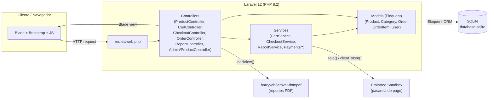

*Figura 1. Diagrama de arquitectura general de JEM Store.* El navegador envía la
petición HTTP a Laravel; los controladores usan los servicios y modelos para leer o
escribir en SQLite, y devuelven una vista Blade al navegador. Los reportes se generan
con `laravel-dompdf` y los pagos con tarjeta se procesan a través de Braintree Sandbox.

# Roles del sistema

JEM Store define dos roles, ambos verificables en el modelo `User` (columna booleana
`is_admin`) y en el middleware `EnsureUserIsAdmin`, que protege las rutas bajo
`/admin/*` y las de reportes de ventas (`/reportes`, `/reportes/pdf`) devolviendo un
error 403 si el usuario autenticado no tiene ese indicador activo.

| Rol | Acciones principales |
|---|---|
| **Cliente** (usuario autenticado sin `is_admin`) | Registrarse e iniciar sesión; consultar y editar su perfil; explorar el catálogo con búsqueda y filtros; gestionar su carrito; completar el checkout y pagar; consultar su historial de pedidos y el detalle/seguimiento de cada uno. |
| **Administrador** (`is_admin = true`) | Todo lo anterior, más: listar productos en `/admin/productos`; crear productos nuevos con foto; editar productos existentes (datos, precio, stock, imagen); eliminar productos; consultar y descargar en PDF los reportes de ventas filtrados por mes o por cliente. |

No se documentan aquí permisos adicionales (por ejemplo, gestión de categorías o de
usuarios desde el panel) porque no existe controlador ni ruta que los implemente en el
código actual.

# Requisitos para utilizar JEM Store

Para usar JEM Store como **cliente** solo se necesita un navegador web moderno y
conexión a internet, accediendo a
[https://jemstore.alwaysdata.net](https://jemstore.alwaysdata.net). No se requiere
instalar nada.

Para **ejecutar el proyecto en un entorno local** (desarrollo o revisión del código) se
necesita:

- PHP ^8.2 con las extensiones habituales de Laravel (`pdo_sqlite`, `mbstring`, `xml`,
  `curl`, etc.).
- Composer 2.
- Node.js y npm.
- Git.

```bash
git clone https://github.com/Eme2004/JEM-Store.git
cd JEM-Store

composer install
npm install

cp .env.example .env
php artisan key:generate

touch database/database.sqlite
php artisan migrate --seed

php artisan storage:link

npm run build   # o `npm run dev` para desarrollo
php artisan serve
```

La aplicación queda disponible en `http://localhost:8000`. El checkout funciona sin
configurar Braintree: en ausencia de credenciales, `AppServiceProvider` enlaza
automáticamente una pasarela simulada equivalente (`FakeSandboxGatewayService`), por lo
que tanto la aplicación como sus pruebas automatizadas funcionan igual sin depender de
una cuenta externa.

# Instrucciones de uso para clientes

Esta sección documenta, paso a paso, el uso de JEM Store desde la perspectiva de un
cliente. Las capturas fueron tomadas en un entorno local de documentación, con una base
de datos temporal separada de la base de datos real del proyecto y con dos cuentas
creadas únicamente para este fin (`cliente.demo@jemstore.test` y
`admin.demo@jemstore.test`); no corresponden a datos de producción.

## 12.1 Acceder a la tienda

**Objetivo:** conocer la página principal y su navegación.

La tienda se accede en producción desde
[https://jemstore.alwaysdata.net](https://jemstore.alwaysdata.net). Desde el inicio, el
usuario encuentra la barra de anuncios rotativa, el menú principal (Novedades, Hombre,
Mujer, Calzado y accesorios, Ofertas), un banner destacado con la colección vigente, y
más abajo carruseles de "Lo nuevo en JEM" y productos en oferta.

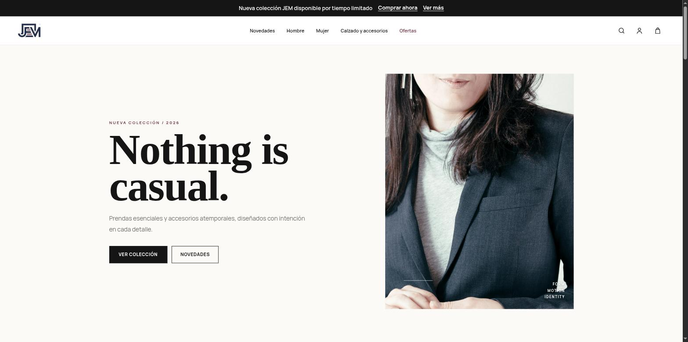

*Figura 2. Página de inicio de JEM Store*, con el menú principal, el banner de colección
y accesos directos a la colección y a las novedades.

## 12.2 Registro

**Objetivo:** crear una cuenta nueva de cliente.

**Pasos:**

1. Hacer clic en el ícono de usuario, en la esquina superior derecha.
2. Seleccionar "Crear cuenta" (o entrar directamente a `/register`).
3. Completar nombre, correo electrónico, contraseña y su confirmación.
4. Enviar el formulario con el botón "Crear cuenta".

**Resultado esperado:** la cuenta queda creada y la sesión inicia automáticamente
(`RegisterController`, scaffolding estándar de Laravel).

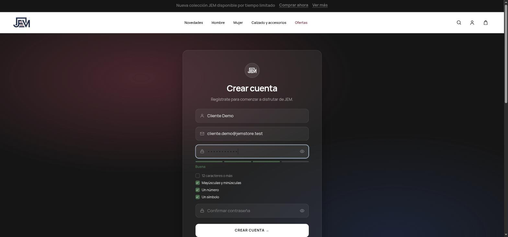

*Figura 3. Formulario de registro*, con nombre y correo completados. Por seguridad, la
contraseña no se muestra en esta documentación.

## 12.3 Inicio de sesión

**Objetivo:** acceder a una cuenta existente.

**Pasos:**

1. Entrar a `/login` desde el ícono de usuario.
2. Completar correo electrónico y contraseña.
3. Confirmar con "Iniciar sesión".

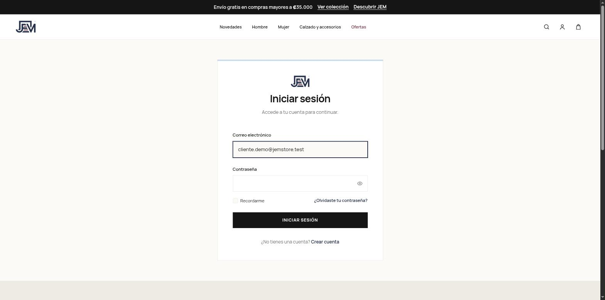

*Figura 4. Formulario de inicio de sesión*, con el correo de la cuenta de
demostración. La contraseña no se muestra por seguridad.

## 12.4 Catálogo

**Objetivo:** explorar los productos disponibles.

En `/productos` se listan todos los productos activos, paginados de 12 en 12, con su
imagen, nombre, categoría y precio (o precio de oferta, si aplica).

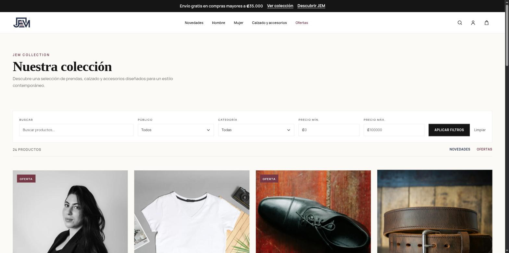

*Figura 5. Catálogo de productos* de JEM Store, con la barra de filtros en la parte
superior y la cuadrícula de productos debajo.

## 12.5 Búsqueda y filtros

**Objetivo:** acotar el catálogo según lo que el cliente busca.

La barra de filtros permite combinar: texto de búsqueda (nombre o descripción),
público (hombre, mujer, unisex), categoría, precio mínimo y precio máximo, además del
acceso rápido a "Novedades" y "Ofertas".

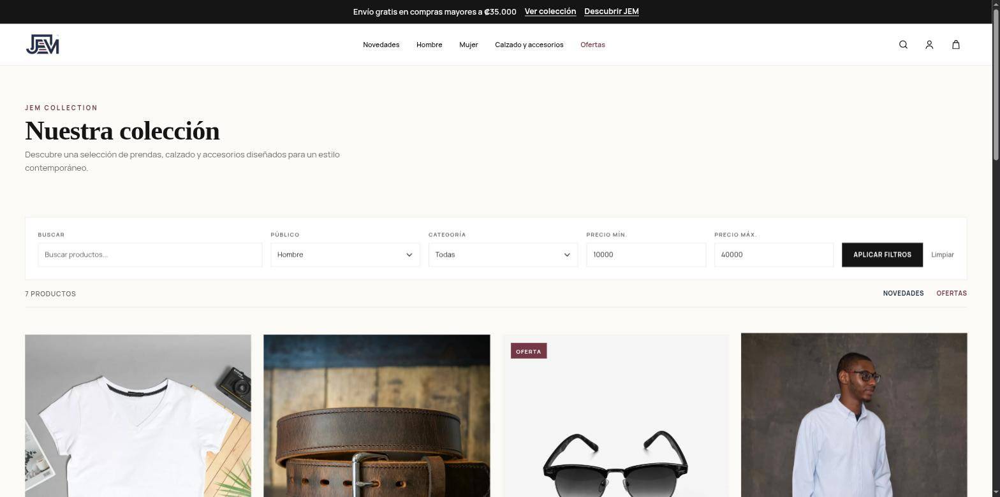

*Figura 6. Catálogo filtrado* por público "Hombre" y un rango de precio entre ₡10.000 y
₡40.000, reduciendo el resultado a los productos que cumplen ambos criterios.

## 12.6 Detalle de producto

**Objetivo:** ver la información completa de un producto antes de comprarlo.

La vista de detalle muestra la imagen, el nombre, la descripción, el precio (con el
precio anterior tachado si el producto está en oferta), el público al que va dirigido,
la disponibilidad, y un selector de cantidad con el botón "Agregar al carrito". Si el
cliente ya visitó otros productos, también aparece una sección de "Vistos
recientemente", construida a partir de una cookie (`jem_recent_products`, con una
vigencia de 30 días) que guarda hasta cinco identificadores de producto.

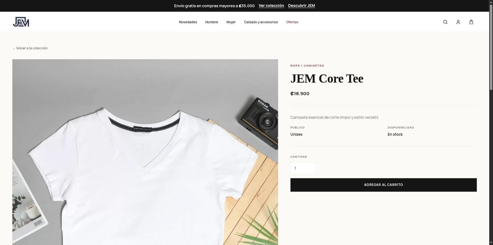

*Figura 7. Detalle de producto* ("JEM Core Tee"), con precio, disponibilidad y el
control para agregarlo al carrito.

## 12.7 Carrito

**Objetivo:** revisar y ajustar los productos antes de comprar.

El carrito (`/carrito`) lista cada producto agregado con su imagen, nombre, precio
unitario, cantidad y subtotal, además de un resumen con subtotal general, IVA y envío
(gratis a partir del monto configurado, o con un costo fijo por debajo de ese umbral).
Desde ahí se puede actualizar la cantidad de cada línea, eliminarla individualmente,
vaciar el carrito completo o continuar hacia el pago.

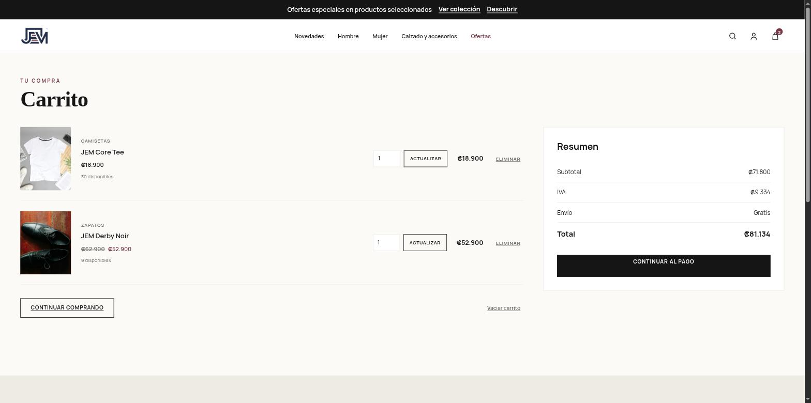

*Figura 8. Carrito de compras* con dos productos agregados (una camiseta y un par de
zapatos en oferta), mostrando subtotal, IVA, envío y total.

## 12.8 Checkout

**Objetivo:** ingresar los datos de envío y avanzar hacia el pago.

El checkout requiere sesión iniciada. La primera sección solicita nombre completo,
correo electrónico, teléfono y dirección de envío; el nombre y el correo llegan
precompletados con los datos de la cuenta.

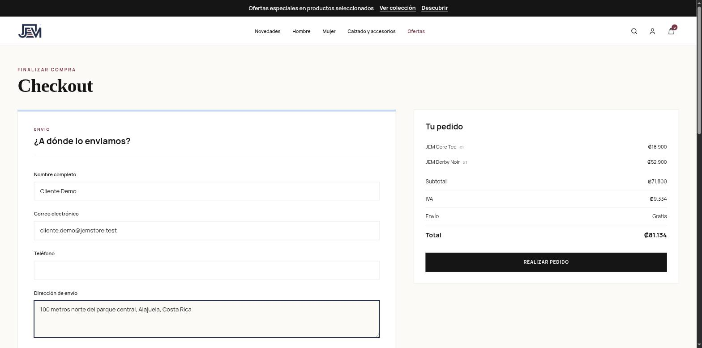

*Figura 9. Datos de envío* del checkout, con un nombre, teléfono y dirección de ejemplo
(no corresponden a una persona real).

## 12.9 Método de pago

**Objetivo:** elegir cómo se pagará el pedido.

Debajo de los datos de envío, el checkout presenta dos métodos de pago: **Tarjeta**, vía
Braintree Sandbox mediante *Hosted Fields* (el número de tarjeta y el CVV se capturan en
campos que sirve directamente Braintree dentro de un iframe, y nunca llegan al servidor
de JEM Store; solo un token de un solo uso —*nonce*— viaja hacia Laravel), y **PayPal**,
cuya confirmación está simulada en el código actual (no existe una integración real con
PayPal). Si el entorno no tiene configuradas credenciales reales de Braintree Sandbox
—como en esta documentación, generada en un entorno local sin esas credenciales—, la
opción de tarjeta aparece deshabilitada y el checkout usa PayPal como único método
disponible.

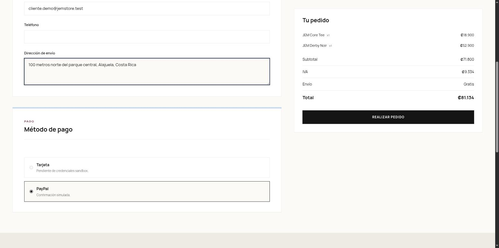

*Figura 10. Método de pago*: "Tarjeta" aparece deshabilitada porque este entorno de
documentación no tiene configuradas credenciales de Braintree Sandbox; "PayPal" queda
seleccionada, con su confirmación simulada. En producción, con las credenciales de
Braintree Sandbox configuradas, la opción de tarjeta se habilita y procesa un pago real
de prueba (nunca dinero real, por tratarse siempre del ambiente sandbox).

## 12.10 Proceso de pago

Al confirmar el pedido, `CheckoutService::charge()` cobra el monto calculado en el
servidor (nunca uno enviado por el cliente) a través de la pasarela configurada:

```
Frontend (Hosted Fields)
  → tokeniza los datos de tarjeta en el navegador
  → nonce de un solo uso
  → Laravel (CheckoutService)
  → Braintree Sandbox (BraintreeGatewayService::sale())
  → resultado: aprobado / rechazado
```

**No se procesa dinero real en ningún caso.** Braintree Sandbox es el ambiente oficial
de pruebas de Braintree; las tarjetas usadas en él (por ejemplo, `4111 1111 1111 1111`)
son tarjetas de prueba documentadas públicamente por Braintree, no instrumentos
financieros reales. Cuando no hay credenciales de Braintree configuradas, el sistema usa
en su lugar `FakeSandboxGatewayService`, una implementación local que reconoce los mismos
identificadores de prueba ("fake nonces") que documenta Braintree, para que la aplicación
y sus pruebas automatizadas se comporten igual sin depender de una cuenta externa.

## 12.11 Confirmación de compra

**Objetivo:** verificar que el pedido se registró correctamente.

Tras el pago aprobado, `CheckoutService::process()` crea el pedido dentro de una
transacción de base de datos (descontando el stock correspondiente) y redirige a la
página de confirmación, que muestra el número de pedido, el número de seguimiento, el
método de pago, el estado del pedido y la dirección de envío.

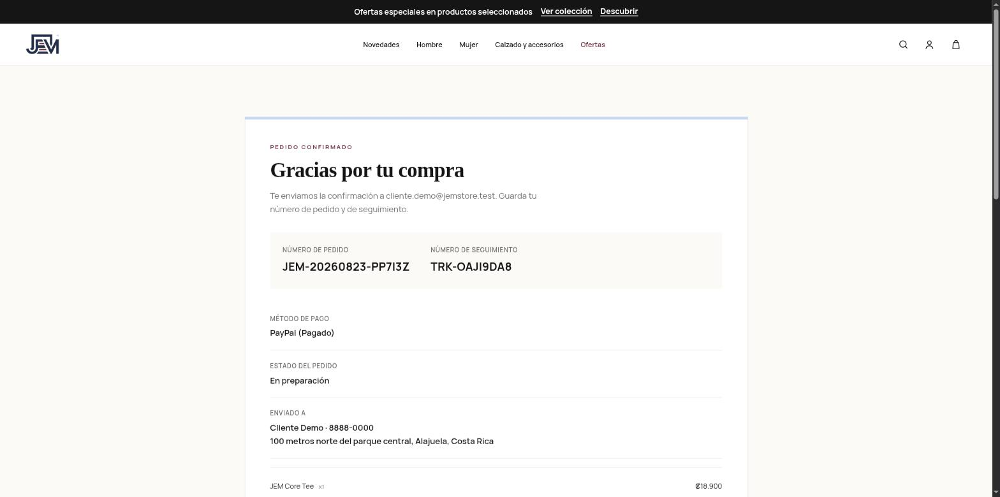

*Figura 11. Confirmación de compra*, con el número de pedido `JEM-20260823-PP7I3Z`, el
número de seguimiento, el método de pago (PayPal, simulado en este entorno) y el estado
"En preparación".

## 12.12 Pedidos

**Objetivo:** consultar el historial de compras.

En `/pedidos`, el cliente ve la lista paginada de sus propios pedidos (diez por
página), con número de pedido, fecha, estado y total.

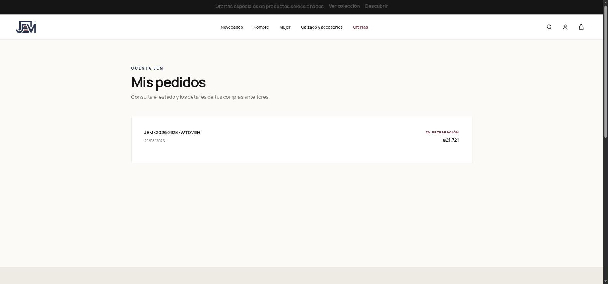

*Figura 12. Historial de pedidos*, mostrando el pedido recién creado.

Al entrar al detalle de un pedido se repite la información de la confirmación —número
de pedido, número de seguimiento, método de pago, estado y dirección de envío—, además
del listado completo de productos comprados.

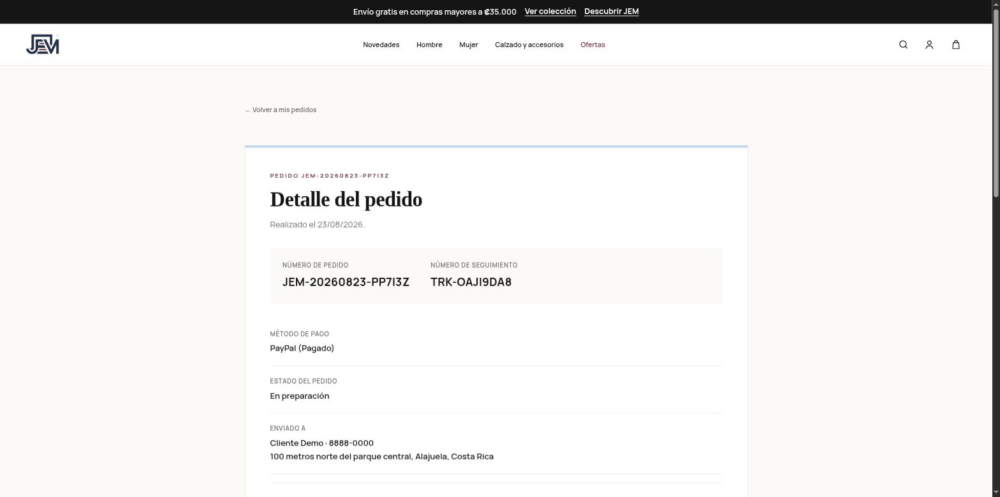

*Figura 13. Detalle del pedido*, con el número de seguimiento visible bajo "Número de
seguimiento".

## 12.13 Seguimiento

JEM Store no implementa un sistema de tracking con proveedores logísticos externos ni
una línea de tiempo de estados. Lo que existe, verificable en el modelo `Order` y en las
vistas de confirmación/detalle, es un **número de seguimiento** (`tracking_number`,
formato `TRK-XXXXXXXX`) generado internamente para cada pedido, y un **estado del
pedido** de texto (`processing` → "En preparación", `shipped` → "Enviado", `delivered` →
"Entregado", `cancelled` → "Cancelado"), ambos visibles en la confirmación de compra y
en el detalle del pedido (figuras 11 y 13).

## 12.14 Perfil

**Objetivo:** consultar y editar los datos de la cuenta.

En "Mi cuenta" (`/profile`) el cliente ve su nombre, correo electrónico y un resumen de
sus pedidos recientes, con acceso a "Editar perfil" para actualizar nombre y correo.

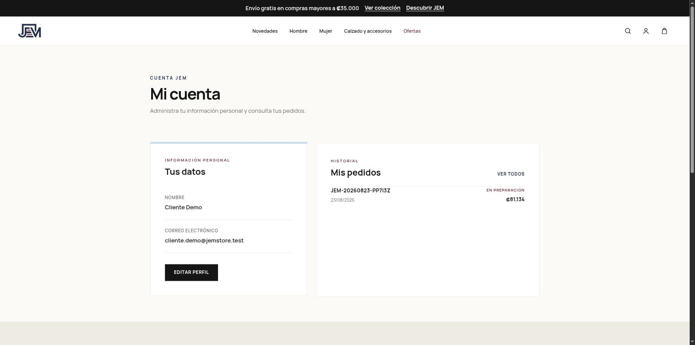

*Figura 14. Mi cuenta*, con los datos de la cuenta de demostración y el resumen del
historial de pedidos. No se muestran datos personales reales.

# Instrucciones de uso para administrador

## 13.1 Acceso al panel

**Objetivo:** entrar al panel de administración.

El acceso a `/admin/*` requiere sesión iniciada **y** que el usuario tenga el indicador
`is_admin` activo en la base de datos; si no lo tiene, `EnsureUserIsAdmin` responde con
un error 403. No existe un formulario separado para administradores: se usa el mismo
login que un cliente, y el enlace "Panel de administración" solo aparece en el menú de
cuenta cuando el usuario autenticado es administrador. Por seguridad, la contraseña de
la cuenta de administración no se incluye en esta documentación.

## 13.2 Lista de productos

**Objetivo:** ver el catálogo completo desde la administración.

`/admin/productos` lista todos los productos (activos e inactivos) paginados de 15 en
15, con miniatura, nombre, categoría, precio, stock y estado, además de los enlaces
"Editar" y "Eliminar" por fila.

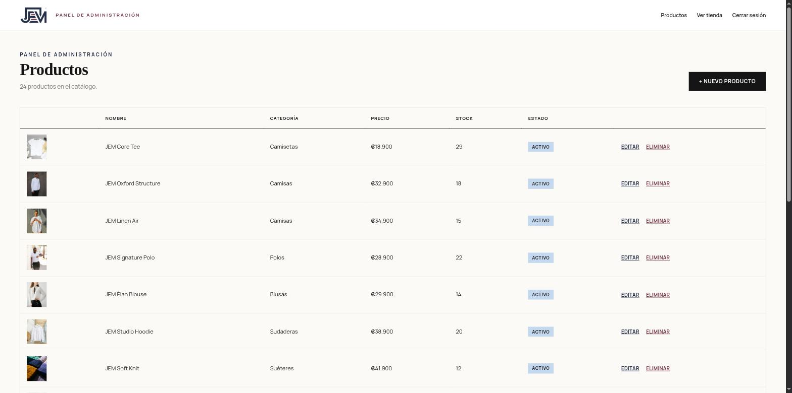

*Figura 15. Lista de productos* en el panel de administración.

## 13.3 Crear producto

**Objetivo:** agregar un producto nuevo al catálogo.

El formulario de creación (`/admin/productos/crear`) solicita nombre, descripción,
categoría, público, precio, precio en oferta (opcional), stock, si el producto está
activo (visible en la tienda) y una foto opcional. El *slug* del producto se genera
automáticamente a partir del nombre.

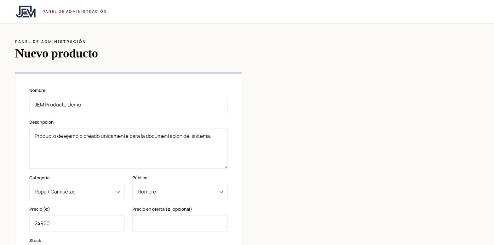

*Figura 16. Nuevo producto*, con los datos básicos completados para un producto de
prueba de esta documentación.

## 13.4 Subir imagen

Al seleccionar una foto, el formulario muestra una vista previa instantánea antes de
guardar. Las imágenes subidas desde el panel se guardan en
`storage/app/public/products/uploads/`, separadas de las imágenes curadas del catálogo
que ya vienen versionadas en el repositorio, de modo que el comando
`products:sync-images` (usado en cada despliegue) nunca las sobrescribe ni las elimina.

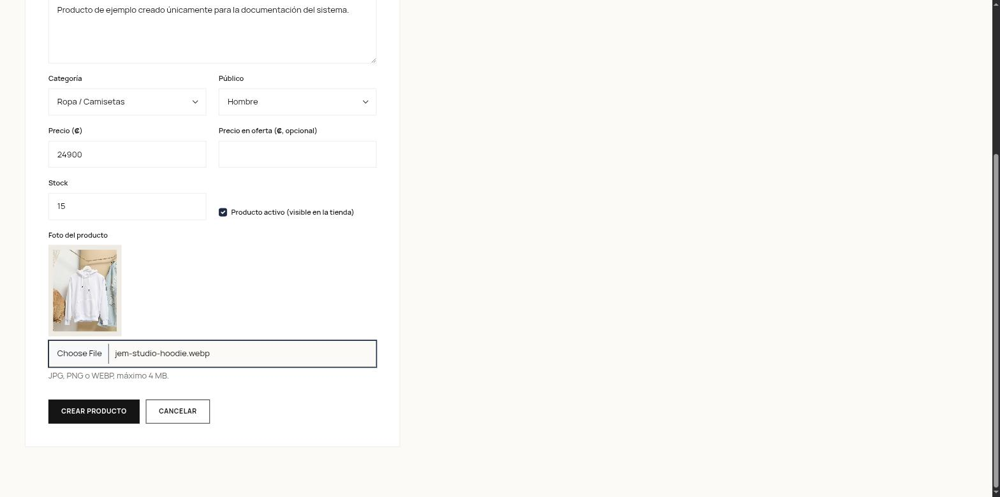

*Figura 17. Vista previa de imagen*, generada en el navegador inmediatamente después de
seleccionar el archivo, antes de enviar el formulario.

## 13.5 Editar producto

**Objetivo:** modificar un producto existente.

El formulario de edición es el mismo que el de creación, pre-cargado con los datos
actuales del producto. Se puede actualizar cualquier campo —incluyendo precio, stock o
categoría— y reemplazar o quitar la foto; si se sube una nueva imagen, la anterior se
elimina automáticamente (solo si vive en la carpeta de imágenes subidas por el panel,
nunca si es una imagen curada del catálogo).

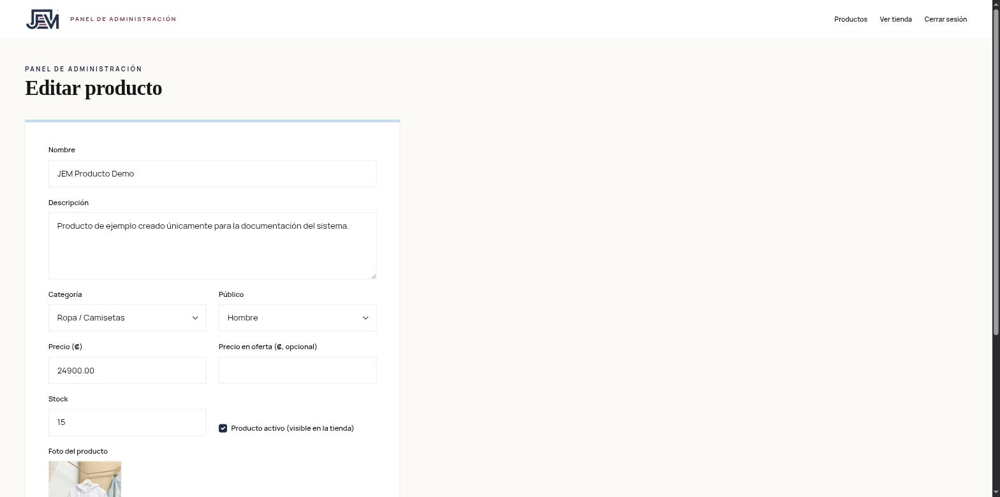

*Figura 18. Editar producto*, mostrando el producto creado en la sección anterior, ya
con su imagen cargada.

# Proceso completo de compra

El proceso de compra, de principio a fin, sigue esta secuencia (ver también el
diagrama de flujo de la sección 17):

1. El cliente explora el catálogo y, opcionalmente, lo filtra o busca un producto.
2. Abre el detalle de un producto.
3. Agrega el producto al carrito, indicando la cantidad.
4. Revisa el carrito y, si lo desea, ajusta cantidades o quita productos.
5. Continúa hacia el checkout. Si no había iniciado sesión, el sistema se la exige antes
   de continuar (ruta protegida por el middleware `auth`).
6. Completa los datos de envío (nombre, correo, teléfono, dirección).
7. Selecciona el método de pago (tarjeta vía Braintree Sandbox, o PayPal simulado).
8. Envía el formulario. El sistema genera un token de checkout de un solo uso para
   evitar que un doble clic o un reenvío del formulario cree dos pedidos.
9. El sistema cobra el monto calculado en el servidor a través de la pasarela de pago.
10. Si el pago es rechazado, se muestra el error y el cliente puede corregir los datos e
    intentar de nuevo, sin perder el contenido del carrito.
11. Si el pago es aprobado, el sistema abre una transacción de base de datos: revalida y
    bloquea el stock de cada producto, y si algo cambió (por ejemplo, ya no hay
    existencias suficientes) cancela la operación sin cobrar el pedido como completado.
12. Con el stock validado, crea el pedido y sus líneas, descuenta el inventario y vacía
    el carrito.
13. Muestra la confirmación de compra, con número de pedido y de seguimiento.
14. El cliente puede consultar después el pedido desde su historial.

# Caso de uso: Realizar compra

| Campo | Descripción |
|---|---|
| **Nombre** | Realizar compra |
| **Código** | CU-01 |
| **Actor principal** | Cliente (usuario autenticado) |
| **Actores secundarios** | Pasarela de pago (Braintree Sandbox) |
| **Objetivo** | Completar la adquisición de uno o más productos del catálogo de JEM Store, desde la selección hasta la confirmación del pedido. |
| **Precondiciones** | El cliente tiene una cuenta y ha iniciado sesión (`middleware('auth')` en las rutas de checkout). El carrito de la sesión contiene al menos un producto (`CheckoutController::index()` redirige a `/carrito` si está vacío). |
| **Postcondiciones** | Se crea un registro `Order` con sus `OrderItem` asociados, con estado `paid` y `processing`. El stock de cada producto comprado queda descontado. El carrito de la sesión queda vacío. El cliente puede consultar el pedido en su historial. |

**Flujo principal:**

1. El cliente consulta el catálogo (`GET /productos`).
2. Selecciona un producto y consulta su detalle (`GET /productos/{slug}`).
3. Agrega el producto al carrito (`POST /carrito`).
4. Revisa el carrito (`GET /carrito`).
5. Continúa hacia el checkout (`GET /checkout`); si no hay sesión iniciada, el sistema
   la solicita antes de continuar.
6. Ingresa los datos de envío y selecciona el método de pago.
7. Envía el formulario de checkout (`POST /checkout`).
8. El sistema valida los datos de envío y el token de checkout.
9. El sistema cobra el monto con la pasarela de pago (`PaymentGatewayContract::sale()`).
10. El sistema revalida el stock dentro de una transacción de base de datos
    (`Product::lockForUpdate()`).
11. El sistema crea el pedido (`Order::create()`) y sus líneas (`OrderItem::create()`).
12. El sistema descuenta el stock de cada producto comprado.
13. El sistema vacía el carrito de la sesión.
14. El sistema muestra la confirmación de compra con número de pedido y de seguimiento
    (`GET /checkout/{order}/confirmacion`).
15. El cliente puede consultar posteriormente el pedido desde `GET /pedidos` y
    `GET /pedidos/{order}`.

**Flujos alternativos:**

- **A1. Cliente no autenticado**: al intentar entrar a `/checkout` sin sesión, Laravel
  redirige al login; tras autenticarse, el cliente retoma el flujo desde el paso 5.
- **A2. Carrito vacío**: si el carrito está vacío al entrar a `/checkout`, o si se vació
  entre la carga de la página y el envío del formulario, el sistema redirige a
  `/carrito` con un mensaje de error, sin permitir continuar.
- **A3. Stock insuficiente**: si el stock disponible bajó por debajo de lo solicitado
  entre que el producto se agregó al carrito y el envío del checkout,
  `CheckoutService` lanza `CheckoutException` y el cliente vuelve al checkout con un
  mensaje indicando qué producto cambió, sin haberse cobrado el pedido.
- **A4. Pago rechazado**: si la pasarela de pago rechaza la transacción (por ejemplo,
  con la tarjeta de prueba de rechazo de Braintree), el sistema no crea ningún pedido y
  muestra el motivo del rechazo, permitiendo reintentar sin recargar la página ni perder
  los datos de envío ya ingresados.
- **A5. Error de validación**: si algún dato de envío es inválido (correo mal formado,
  campo requerido vacío, nonce de pago faltante cuando el método es tarjeta), Laravel
  devuelve el formulario con los errores específicos de cada campo, conservando los
  valores ya ingresados.
- **A6. Reenvío o doble clic**: el sistema genera un token de checkout de un solo uso al
  cargar el formulario; si el mismo formulario se envía dos veces (doble clic, botón
  "atrás" del navegador seguido de un nuevo envío), el segundo envío se rechaza con un
  mensaje de "pedido ya procesado", evitando crear un pedido duplicado.

# Diagrama de caso de uso del proceso de compra

El siguiente diagrama UML de caso de uso resume los actores y las relaciones entre las
funcionalidades involucradas en el proceso de compra descrito en la sección anterior.

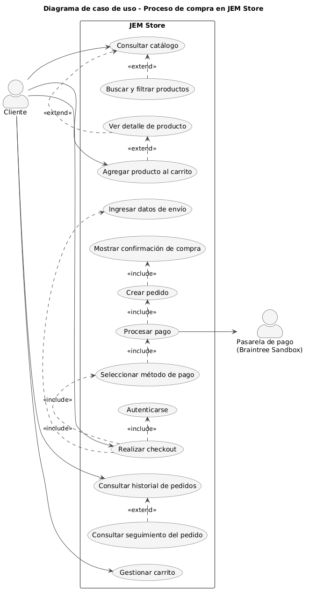

*Figura 19. Diagrama de caso de uso del proceso de compra.* El actor "Cliente" inicia
directamente los casos de uso de nivel superior (consultar catálogo, agregar al
carrito, gestionar carrito, realizar checkout, consultar historial); "Realizar
checkout" incluye obligatoriamente autenticarse, ingresar los datos de envío y
seleccionar el método de pago, que a su vez incluye procesar el pago con la pasarela
Braintree Sandbox, crear el pedido y mostrar la confirmación. "Buscar y filtrar
productos" y "Ver detalle de producto" extienden la consulta del catálogo, y
"Consultar seguimiento" extiende la consulta del historial de pedidos.

El archivo fuente editable de este diagrama está en
`docs/documentacion/diagramas/caso-uso-compra.puml` (formato PlantUML); también se
incluye una versión SVG en la misma carpeta.

# Diagrama de flujo del proceso de compra

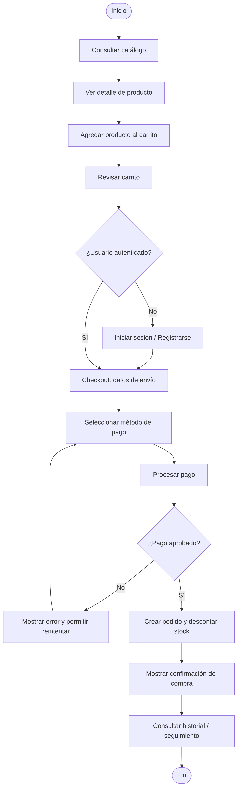

*Figura 20. Diagrama de flujo del proceso de compra*, desde que el cliente consulta el
catálogo hasta que confirma la compra y puede consultar su seguimiento. El diagrama
muestra explícitamente los dos puntos de decisión del proceso: si el usuario está
autenticado antes del checkout, y si el pago es aprobado por la pasarela.

El archivo fuente editable está en `docs/documentacion/diagramas/flujo-compra.mmd`
(formato Mermaid).

# Seguridad implementada

JEM Store aplica los siguientes controles de seguridad, todos verificables en el código:

- **Autenticación**: gestionada por el sistema de autenticación de Laravel
  (`Auth::routes()`), con contraseñas almacenadas con *hash* (cast `'password' =>
  'hashed'` en el modelo `User`, que usa `bcrypt`/Hash de Laravel) y nunca en texto
  plano.
- **Protección CSRF**: todos los formularios del sitio incluyen el token `@csrf` de
  Laravel, verificado automáticamente en cada envío.
- **Validación de entradas**: cada acción de controlador valida sus datos de entrada con
  `Request::validate()` (tipos, longitudes, formatos de correo, existencia de claves
  foráneas, rangos numéricos), tanto en el catálogo y el carrito como en el checkout y
  en la administración de productos.
- **Control de acceso por middleware**: las rutas de perfil, checkout y pedidos
  requieren sesión iniciada (`middleware('auth')`); las rutas de administración y de
  reportes de ventas (`/reportes`, `/reportes/pdf`) requieren, además, que el usuario
  tenga `is_admin = true` (`EnsureUserIsAdmin`, que responde 403 en caso contrario). El
  enlace "Reportes de ventas" del menú y del footer también se oculta para usuarios sin
  ese rol.
- **Protección contra doble envío del checkout**: un token de un solo uso, generado al
  cargar el formulario de checkout y guardado en la sesión, se invalida únicamente
  cuando el pedido se crea con éxito; esto evita que un doble clic o un reenvío del
  formulario genere pedidos duplicados.
- **Transacciones de base de datos y bloqueo de filas**: la creación del pedido ocurre
  dentro de una transacción (`DB::transaction()`) que bloquea (`lockForUpdate()`) y
  revalida el stock de cada producto antes de descontarlo, evitando condiciones de
  carrera si dos clientes compran el mismo producto casi al mismo tiempo.
- **El monto del pago siempre se calcula en el servidor**: `CheckoutService` nunca
  confía en un monto enviado por el cliente; lo recalcula a partir del contenido real
  del carrito antes de cobrar.
- **Datos de tarjeta fuera del servidor de JEM Store**: el pago con tarjeta usa
  *Hosted Fields* de Braintree; el número de tarjeta y el CVV se capturan directamente
  por Braintree dentro de un iframe y nunca llegan al backend de JEM Store, que solo
  recibe un token de un solo uso (*nonce*).
- **Validación de archivos subidos**: las imágenes de producto se validan por tipo
  (`jpeg,jpg,png,webp`) y tamaño máximo (4 MB), y solo se permite borrar archivos que
  vivan dentro de la carpeta de subidas del panel, nunca las imágenes curadas del
  catálogo versionadas en Git.
- **HTTPS en producción**: el sitio publicado en alwaysdata sirve bajo HTTPS.

Esta lista describe los controles existentes en el código; no implica que el sistema
sea invulnerable, sino que documenta las medidas de seguridad efectivamente
implementadas.

# Base de datos

JEM Store usa **SQLite** como motor de base de datos, con el esquema definido en
`database/migrations/`. Las tablas propias de la aplicación son:

| Entidad | Propósito |
|---|---|
| `users` | Cuentas de usuario (clientes y administradores), con la columna `is_admin` para distinguir el rol. |
| `categories` | Categorías de producto, con relación auto-referenciada (`parent_id`) para representar grupo → subcategoría (por ejemplo, "Ropa" → "Camisetas"). |
| `products` | Catálogo de productos: nombre, slug, descripción, precio, precio de oferta, stock, público objetivo, imagen y estado activo/inactivo. |
| `orders` | Pedidos: montos (subtotal, impuesto, envío, total), método y estado del pago, datos de la pasarela usada, estado del pedido y datos de envío. |
| `order_items` | Líneas de cada pedido: producto, precio unitario al momento de la compra, cantidad y subtotal de la línea. |

Adicionalmente, Laravel usa las tablas estándar `cache`, `jobs` y las de sesión, que no
son específicas de JEM Store.

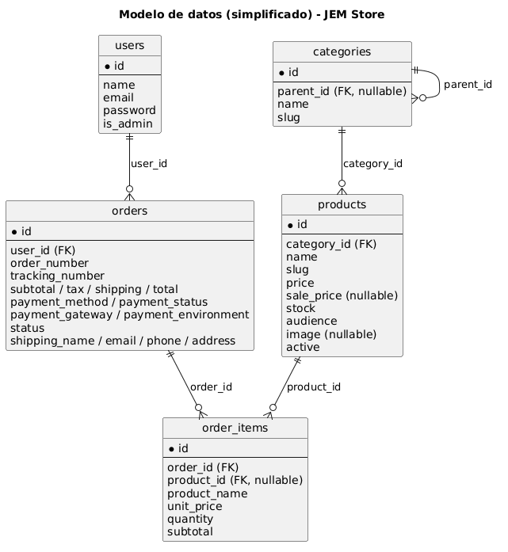

*Figura 21. Modelo de datos simplificado*: una categoría puede tener subcategorías
(auto-relación) y agrupa productos; un usuario tiene muchos pedidos; un pedido tiene
muchas líneas, cada una asociada opcionalmente a un producto del catálogo (opcional
porque el nombre y el precio de la línea quedan guardados de forma independiente, para
que el histórico de un pedido no cambie aunque el producto se edite o elimine después).

# Pasarela de pago

El pago con tarjeta se procesa mediante **Braintree**, siempre en modo **Sandbox**
(ambiente oficial de pruebas de Braintree, documentado así explícitamente tanto en el
código —`BRAINTREE_ENV=sandbox`— como en la página de Disclaimer del sitio). El sistema
usa una abstracción (`PaymentGatewayContract`) con dos implementaciones intercambiables:

- **`BraintreeGatewayService`**: usa el SDK oficial `braintree/braintree_php` para
  generar el *client token* del frontend y procesar la venta (`sale()`) contra la API
  real de Braintree Sandbox.
- **`FakeSandboxGatewayService`**: se activa automáticamente cuando no hay credenciales
  de Braintree configuradas (`BRAINTREE_MERCHANT_ID`, `BRAINTREE_PUBLIC_KEY`,
  `BRAINTREE_PRIVATE_KEY` vacíos). Reconoce los mismos identificadores de prueba
  ("fake nonces") que Braintree documenta oficialmente para probar sin necesidad de
  cargar sus *Hosted Fields*, de modo que el comportamiento —incluyendo aprobación y
  rechazo— es equivalente al del sandbox real.

`AppServiceProvider` decide automáticamente cuál de las dos usar, según si las
credenciales están configuradas; el resto del código (`CheckoutService`,
`CheckoutController`) no cambia en ningún caso.

En el checkout, la opción "Tarjeta" solo se habilita cuando el sitio tiene credenciales
reales de Braintree Sandbox configuradas (esto sucede en producción); la opción
"PayPal" está siempre disponible, pero su confirmación es simulada en el código actual
—no existe una integración real con la API de PayPal—.

**Nunca se procesa dinero real en JEM Store.** Braintree Sandbox es el ambiente de
pruebas oficial de Braintree, y todas las tarjetas usadas en él (como la tarjeta de
prueba documentada `4111 1111 1111 1111`) son instrumentos de prueba sin efecto
financiero real.

# Reportes PDF

`/reportes` presenta un reporte de ventas filtrable por **mes** y por **cliente**,
calculado únicamente sobre pedidos con estado de pago `paid` (`ReportService::query()`).
La pantalla muestra indicadores (pedidos, subtotal, impuesto, envío y total vendido) y
una tabla con cada pedido que cumple el filtro.

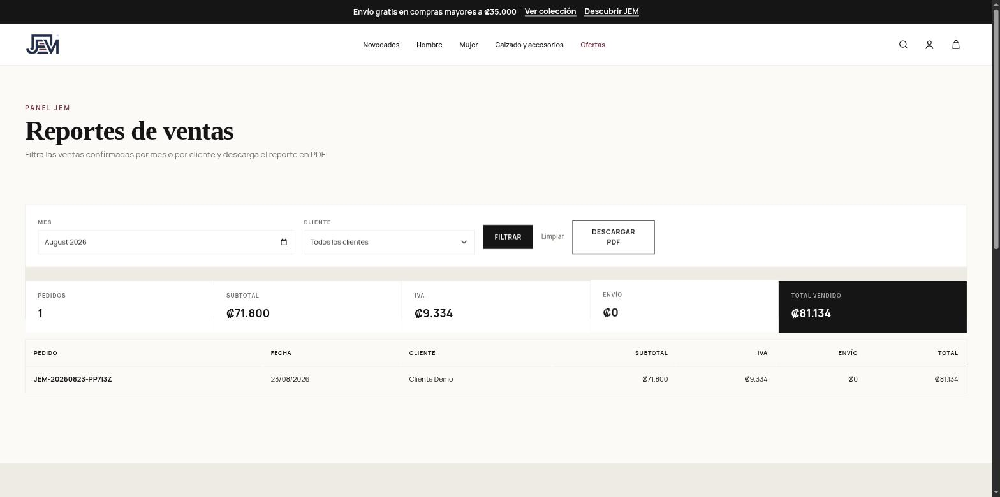

*Figura 22. Reportes de ventas*, filtrados por el mes en el que se generó el pedido de
esta documentación.

Desde la misma pantalla, el botón "Descargar PDF" genera el mismo reporte en un
documento PDF (`ReportController::pdf()`, vía `barryvdh/laravel-dompdf`), con el logo de
JEM Store, los mismos indicadores, la tabla de pedidos y un resumen final, además de
numeración de página.

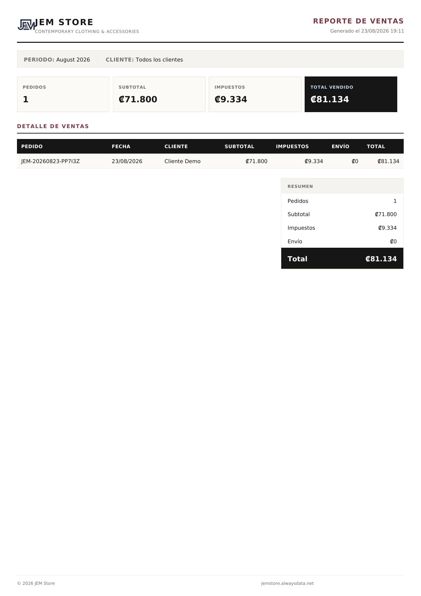

*Figura 23. Reporte de ventas en PDF*, generado con los mismos datos y filtro que la
figura anterior.

# Hosting, HTTPS y despliegue

JEM Store se despliega automáticamente en **alwaysdata**
([jemstore.alwaysdata.net](https://jemstore.alwaysdata.net), servido bajo HTTPS) cada
vez que se hace *push* a la rama `main`, mediante el flujo definido en
`.github/workflows/deploy.yml`:

```
Desarrollador
  → git push a main
    → GitHub Actions
      → instalar dependencias (Composer + npm)
      → compilar assets (npm run build / Vite)
      → correr las pruebas automatizadas (php artisan test)
      → si las pruebas fallan, el despliegue se detiene aquí
      → reinstalar dependencias de Composer solo para producción
      → sincronizar el proyecto al servidor por rsync sobre SSH
      → migrar la base de datos (--force), enlazar storage,
        sincronizar imágenes de producto, limpiar y regenerar cachés
    → https://jemstore.alwaysdata.net actualizado
```

El despliegue nunca sobrescribe el archivo `.env` ni la base de datos
`database/database.sqlite` de producción: el flujo los excluye explícitamente de la
sincronización, y esta no usa borrado (`rsync --delete`), por lo que archivos que solo
existen en el servidor —como los datos reales o las imágenes subidas desde el panel de
administración— no se eliminan en cada despliegue.

# Pruebas automatizadas

El proyecto incluye una suite de pruebas automatizadas con PHPUnit
(`php artisan test`), que cubre catálogo, carrito, checkout (pago aprobado, pago
rechazado, doble envío del formulario), autenticación, perfil, historial de pedidos,
panel de administración, reportes, páginas legales y la sincronización de imágenes de
producto.

Al ejecutar `php artisan test` en este entorno de documentación, el resultado fue:

**120 tests / 307 assertions, sin fallos.**

Estas mismas pruebas son las que corre `deploy.yml` antes de cada despliegue: si alguna
falla, el despliegue a producción no se ejecuta.

# Capturas del sistema

Todas las capturas de esta documentación se tomaron en un entorno local de
documentación, con una base de datos SQLite temporal (independiente de la base de
datos real del proyecto) y con cuentas de prueba creadas únicamente para este fin. No
contienen datos personales reales, contraseñas, ni información de pago sensible. El
índice completo, en el orden en que aparecen en el documento, es el siguiente:

| Figura | Archivo | Contenido |
|---|---|---|
| 2 | `01-inicio.png` | Página de inicio |
| 3 | `02-registro.png` | Formulario de registro |
| 4 | `03-login.png` | Formulario de inicio de sesión |
| 5 | `04-catalogo.png` | Catálogo de productos |
| 6 | `05-filtros.png` | Catálogo con filtros aplicados |
| 7 | `06-detalle-producto.png` | Detalle de producto |
| 8 | `07-carrito.png` | Carrito de compras |
| 9 | `08-checkout.png` | Datos de envío del checkout |
| 10 | `09-pago-sandbox.png` | Selección de método de pago |
| 11 | `10-confirmacion-compra.png` | Confirmación de compra |
| 12 | `11-mis-pedidos.png` | Historial de pedidos |
| 13 | `12-detalle-pedido.png` | Detalle de un pedido |
| 14 | `13-perfil.png` | Perfil del cliente |
| 15 | `14-admin-productos.png` | Panel admin: lista de productos |
| 16 | `15-admin-crear-producto.png` | Panel admin: crear producto |
| 17 | `17-admin-subir-imagen.png` | Panel admin: vista previa de imagen |
| 18 | `16-admin-editar-producto.png` | Panel admin: editar producto |
| 19 | Diagrama | Caso de uso del proceso de compra |
| 20 | Diagrama | Flujo del proceso de compra |
| 21 | Diagrama | Modelo de datos |
| 22 | `18-reportes.png` | Reportes de ventas |
| 23 | `19-reporte-ventas-pdf.png` | Reporte de ventas en PDF |

(La figura correspondiente a `20-pagina-legal.png`, la página de Disclaimer, se
referencia en la sección de páginas legales del repositorio y no se incluyó como figura
numerada independiente para no extender innecesariamente el documento.)

# Páginas legales

JEM Store incluye tres páginas legales propias, accesibles desde el pie de página del
sitio: **Disclaimer** (aclara que el proyecto es académico/portafolio, que los pagos son
simulados o de sandbox, y el origen de las fotografías de producto), **Términos de uso**
y **Política de privacidad**.

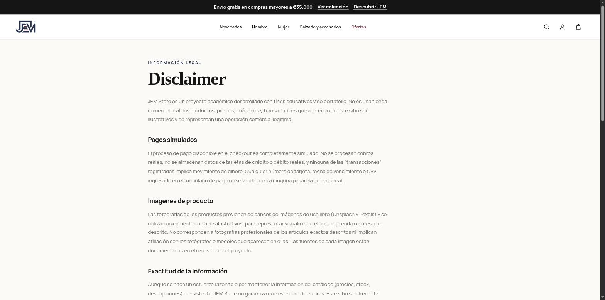

*Figura 24. Página de Disclaimer* de JEM Store, donde el propio sitio documenta
públicamente su naturaleza académica y el carácter simulado de sus pagos.

# Conclusiones

JEM Store cumple, de extremo a extremo, el flujo de una tienda en línea real: un
cliente puede registrarse, explorar el catálogo con filtros, armar un carrito, pagar a
través de una pasarela real en modo sandbox, recibir la confirmación de su pedido y
consultarlo después; un administrador puede gestionar el catálogo completo desde un
panel propio y generar reportes de ventas en PDF, filtrables por mes o por cliente.

El proyecto demuestra la aplicación práctica de conceptos centrales del desarrollo
backend con Laravel —arquitectura MVC, servicios, transacciones de base de datos,
autenticación y autorización, integración con una pasarela de pago externa— junto con
prácticas de ingeniería de software más amplias: una suite de pruebas automatizadas que
se ejecuta en cada cambio, y un pipeline de integración y despliegue continuos que
publica automáticamente cada versión aprobada a un servidor de producción bajo HTTPS.

Como todo proyecto académico, JEM Store tiene un alcance delimitado y así lo declara
explícitamente: no procesa pagos reales, no integra logística de envío real, y su
número de seguimiento es una simulación interna. Dentro de esos límites, sin embargo, el
sistema es completamente funcional y reproduce con fidelidad el comportamiento técnico
—incluyendo el manejo de errores, condiciones de carrera y seguridad— que tendría una
tienda en producción.

# Referencias

- Laravel Documentation. [https://laravel.com/docs](https://laravel.com/docs)
- PHP. [https://www.php.net/](https://www.php.net/)
- Bootstrap. [https://getbootstrap.com/](https://getbootstrap.com/)
- SQLite. [https://www.sqlite.org/](https://www.sqlite.org/)
- Vite. [https://vite.dev/](https://vite.dev/)
- Git. [https://git-scm.com/](https://git-scm.com/)
- GitHub. [https://github.com/](https://github.com/)
- GitHub Actions. [https://docs.github.com/actions](https://docs.github.com/actions)
- alwaysdata. [https://www.alwaysdata.com/](https://www.alwaysdata.com/)
- Braintree Developer Docs. [https://developer.paypal.com/braintree/docs](https://developer.paypal.com/braintree/docs)
- dompdf / barryvdh/laravel-dompdf. [https://github.com/barryvdh/laravel-dompdf](https://github.com/barryvdh/laravel-dompdf)
- Repositorio del proyecto: [https://github.com/Eme2004/JEM-Store](https://github.com/Eme2004/JEM-Store)
- Sitio en producción: [https://jemstore.alwaysdata.net](https://jemstore.alwaysdata.net)
